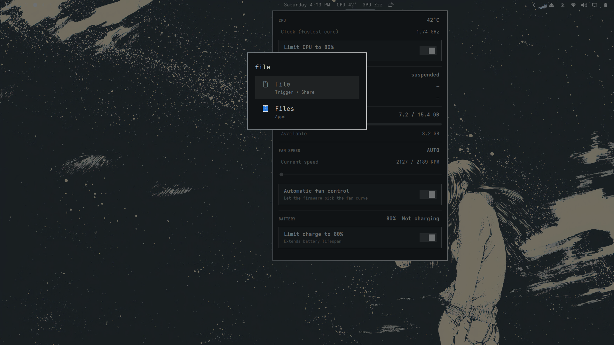

# Predator Control

An [Omarchy](https://omarchy.org/) bar widget for Acer Predator laptops running
[Linuwu-Sense](https://github.com/0x7375646F/Linuwu-Sense). Built and tested on a
**Predator Triton 300 PT315-53** (i7-11800H, RTX 3060).
Unofficial community project, not affiliated with or endorsed by Acer.


The bar shows `CPU 43°  GPU 37°` live. Clicking it drops down a panel with:



- **CPU**: temperature, fastest-core clock, and a *Limit CPU to 80%* toggle
  (`intel_pstate/max_perf_pct`) to trim boost spikes and heat
- **GPU**: model, temp, load, power and VRAM. It never wakes a suspended dGPU
  (the bar shows `Zzz` instead), and readings are cached for 30 s while the panel
  is closed so polling doesn't keep the GPU awake
- **Memory**: used / total / available
- **Fan speed**: RPM readout, manual slider, and an *Automatic fan control*
  toggle. Turning auto off starts the slider at the speed the fans are already
  running, so there's no jump
- **Battery**: charge level and a *Limit charge to 80%* toggle
  (`predator_sense/battery_limiter`)

## Requirements

- Omarchy (Quickshell shell with plugin support)
- Linuwu-Sense loaded, exposing `/sys/devices/platform/acer-wmi/predator_sense/`
- `nvidia-smi` for GPU stats (optional)
- Intel CPU with `intel_pstate` for the CPU cap (optional)

## Install

```bash
omarchy plugin add https://github.com/dawestheperson/omarchy-predator-widget.git --enable
omarchy bar move dawestheperson.predator --after omarchy.clock
```

The control files are root-only, so run the setup script once. It installs a
small boot service that makes the fan, battery and CPU-cap files writable by the
`wheel` group. Read it first; **any process running as you can then change fan
speed and charge limits.**

```bash
sudo bash ~/.config/omarchy/plugins/dawestheperson.predator/install-perms.sh
```

If controls stop working after a module reload:
`sudo systemctl restart predator-sense-perms`.

Undo: `sudo systemctl disable --now predator-sense-perms && sudo rm /etc/systemd/system/predator-sense-perms.service /usr/local/sbin/predator-sense-perms`

## Notes and limits

- **Fan curve is machine-specific.** The RPM-to-percent table in `Panel.qml`
  (`rpmCurve`) was measured on a PT315-53. On other models, re-measure it by
  writing `N,N` to `fan_speed` and reading `fan1_input`.
- **`fan_speed` format** is `cpu,gpu` percent; `0,0` means firmware auto.
- **Keyboard RGB is not included.** Linuwu-Sense only creates `four_zoned_kb` for
  models with a quirk entry, and the PT315-53 has none.
- **GPU cache is private.** The short-lived `nvidia-smi` cache is kept in a
  `0700`, owner-checked directory under `$XDG_RUNTIME_DIR` and replaced
  atomically without following symlinks. Without such a directory there is no
  cache file at all; nothing is written to `/tmp`.
- **The CPU cap resets at reboot**, like any sysfs setting.
- The widget uses Omarchy's internal shell UI components, which aren't a stable
  API. A large shell update could require small edits.
- Linuwu-Sense is an out-of-tree module; a new kernel can break its build until
  upstream catches up. The temps and RAM readouts keep working regardless.

## Files

| File | Purpose |
|---|---|
| `manifest.json` | Plugin manifest (plugin id `dawestheperson.predator`) |
| `Panel.qml` | Bar button and dropdown |
| `stats.sh` | One-shot JSON telemetry, read-only |
| `install-perms.sh` | One-time permissions service (run with sudo) |
| `LICENSE` | MIT |

## License

[MIT](LICENSE)
